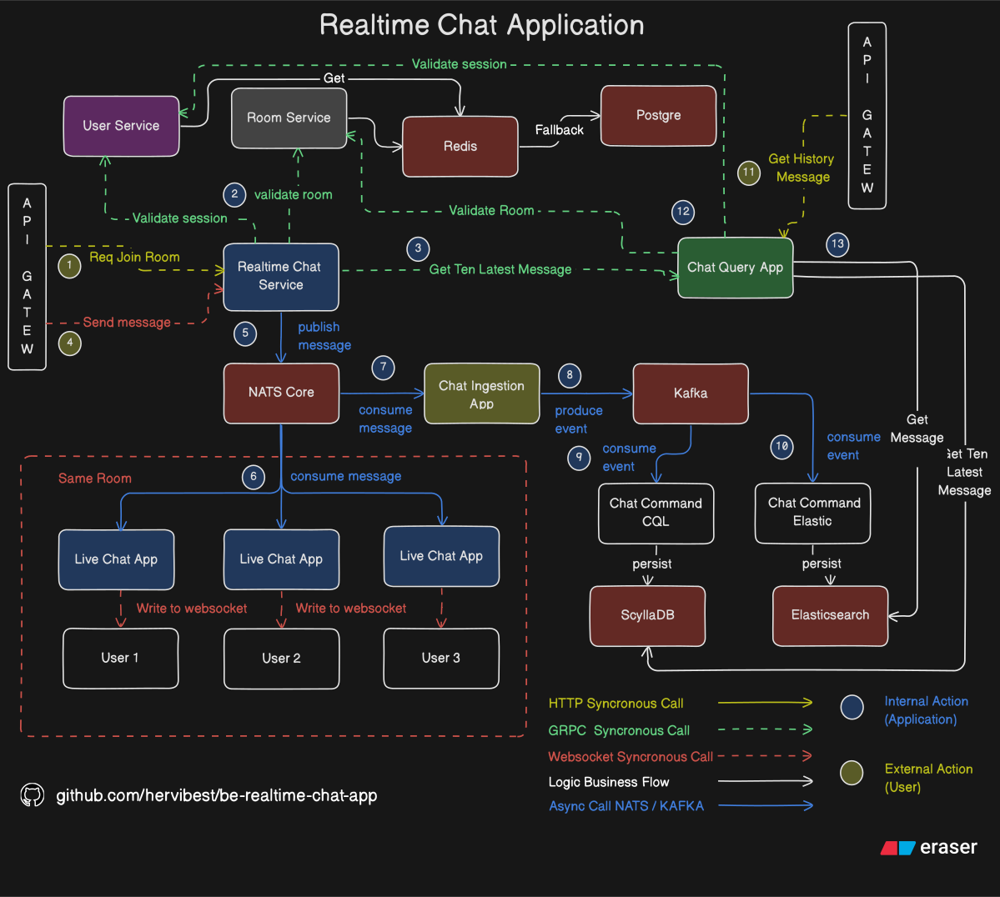

# Realtime Chat Application

A scalable, modular realtime chat architecture using WebSocket, gRPC, Kafka, and NATS — supporting fanout delivery, persistence, and efficient message querying.

## Tech Stack

| Technology     | Description                        |
|----------------|------------------------------------|
|            | Main programming language (backend) |
|  | Realtime communication              |
|        | Internal service communication      |
|      | Fanout pub/sub messaging            |
|  | Event streaming backbone            |
|  | High-throughput message storage     |
|  | Message history + search indexing   |
|  | Auth & room data storage            |
|    | Session & credential cache          |
|  | Containerized environment           |


## Secret Management

There are two `.env.example` files:

1. One is for the root-level Docker Compose setup.
2. The others are service-specific environment configs.

You can start by copying `.env.example` to `.env` and updating the `POSTGRES_PASSWORD`. Most default values can be used as-is.

> Note: Each service may require its own .env file. Just ensure the PostgreSQL password is set correctly.
> 

---

## Running on macOS (Colima Recommended)

If you're using macOS (especially with M1/M2), it's recommended to run Docker through **Colima**.

Make sure to allocate enough memory — at least **3 GB RAM** is recommended (ScyllaDB is memory-intensive).

---

## Running Docker Compose

This will start all external dependencies (PostgreSQL, ScyllaDB, Redis, Kafka, etc.)

```bash
docker compose up
```

## Service Startup (with Makefile)
The following steps assume you’re using the provided Makefile to simplify running migrations and starting services:

1. make user-migrate-up
2. make room-migrate-up
3. make cql-migrate-up
4. make start-user-svc
5. make start-room-svc
6. make start-chat-query-svc
7. make start-chat-realtime-svc
8. make start-chat-ingestion-svc
9. make start-chat-command-cql-svc
10. make start-chat-command-elastic-svc

  
## Main Chat Flow



1. User joins a room via HTTP request through the API Gateway.  
2. Live Chat Service validates the user session via User Service and verifies the room via Room Service using gRPC calls.  
3. If both validations pass, it fetches the latest 10 messages from Chat Query App (gRPC). The user is then upgraded to a WebSocket connection and receives those 10 messages through the socket.  
4. The user sends messages via WebSocket to the Live Chat Service.  
5. The message is published to NATS Core, which fans out to all users subscribed to the same room.  
6. Each connected user with an active WebSocket receives the message and writes it to their socket.  
7. In parallel, Chat Ingestion App also subscribes to NATS, consuming messages via a buffered channel for backpressure handling.  
8. After consuming, it produces an event to Kafka, appending the message to the "message" topic.  
9. The first Kafka consumer, Chat Command CQL, persists the message to ScyllaDB. This data is used for fetching the latest messages in real-time.  
10. The second consumer, Chat Command Elastic, persists the message to Elasticsearch in batches, for efficient search and historical queries.  
11. As an additional feature, the user can request chat history via the API Gateway.  
12. The Chat Query App validates the user's session and room.  
13. If valid, it fetches historical messages from Elasticsearch and returns them to the user.

## Service Breakdown

| Service | Host and Port | Delivery |
| --- | --- | --- |
| User service | localhost:8001 localhost:50051 | REST and gRPC |
| Room service  | localhost:8002 localhost:50052 | REST and gRPC |
| Chat Service | localhost:8003 | REST and Websocket |
| Chat Ingestion Service | - | Worker Only (NATs consumer) |
| Chat Command CQL  Service | - | Worker Only (Kafka Consumer) |
| Chat Command Elastic  Service | - | Worker Only (Kafka Consumer) |
| Chat Query Service | localhost:8004 localhost:50054 | REST and gRPC |

## Microservices Overview

### User Service

Handles user authentication. Supports register, login, and session validation via gRPC.

- Uses Redis for caching login credentials.
- PostgreSQL as the main database.

### Room Service

Manages room data. Provides CRUD operations via REST and room validation via gRPC.

- Acts as the source of truth for room information.

### Chat Service

The core service for WebSocket and real-time messaging. Uses gRPC to validate users and rooms.

- Receives messages through WebSocket.
- Publishes messages to NATS for fanout to other users.

### Chat Ingestion Service

Acts as a bridge between NATS and Kafka. Subscribes to NATS and forwards messages to Kafka using a buffered channel to avoid overload.

- Helps apply backpressure before Kafka.

### Chat Command CQL

Consumes messages from Kafka and saves them to ScyllaDB.

- Handles real-time message persistence.

### Chat Command Elasticsearch

Consumes messages from Kafka and saves them to Elasticsearch using batch processing.

- Optimized for search and historical queries.

### Chat Query Service

Provides APIs to get messages from ScyllaDB or Elasticsearch.

- Uses gRPC for latest messages (ScyllaDB).
- Uses REST API for historical messages (Elasticsearch).

# Documentation

## Api spec

https://documenter.getpostman.com/view/17668293/2sB34bKiTy

# Milestone

- [x]  Realtime Chat Core
- [ ]  Dockerize All Service
- [ ]  Unit Test and Integration Test
- [ ]  [Chat Query Service] Get Chat History Data
- [ ]  Real Production Grade Environtment Testing
- [ ]  Chat Delay for UX Friendly User Chats
- [ ]  Local Load And Performance Testing (using k6)
- [ ]  Ratelimit - using redis
- [ ]  [Issue] - Race condition in websocket
- [ ]  Batch insert (Elasticsearch)

